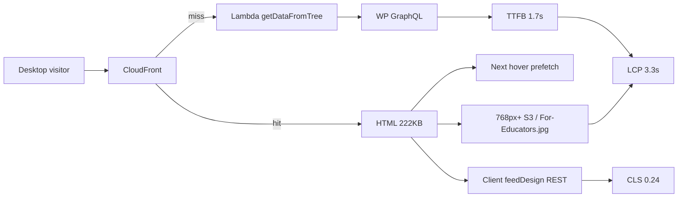

# hecmedia.org desktop PageSpeed fix plan

**Report:** [PageSpeed desktop 29mejls8xx](https://pagespeed.web.dev/analysis/https-hecmedia-org/29mejls8xx?form_factor=desktop) (14 Aug 2026, 7:29 PM)  
**Sibling:** [mobile plan](./PAGESPEED-MOBILE-FIX-PLAN-2026-08-14.md)  
**Code:** `~/Repos/hecmedia` + WordPress GraphQL (`hectv-wp`)  
**Goal:** Pass desktop Core Web Vitals in CrUX (28-day field). Same origin as mobile; device slice is `DESKTOP`.

Field data is **origin-level** (not enough samples for the exact URL). Homepage still drives LCP/CLS.

Desktop is closer to a pass than mobile. Do **not** treat this as a separate rewrite. Share cache and origin work with the mobile plan. The extra desktop work is **larger LCP media**, **hover prefetch**, and **wide-layout CLS** (wallpaper / Featured rows).

## What the report says (desktop, 16 Jul–12 Aug 2026)

| Metric | p75 | Pass bar | Status |
|---|---:|---|---|
| **LCP** | **3.3 s** | ≤ 2.5 s | Fail (15% poor, 25% needs work) |
| **INP** | **60 ms** | ≤ 200 ms | Pass (92% good) |
| **CLS** | **0.24** | ≤ 0.1 | Fail (only 37% good) |
| FCP | 1.9 s | ≤ 1.8 s | Barely fail (71% already good) |
| TTFB | **1.7 s** | ≤ 0.8 s | Fail (23% poor, 41% needs work) |

Compare with [mobile](./PAGESPEED-MOBILE-FIX-PLAN-2026-08-14.md): LCP 4.5 s, CLS 0.44, TTFB 2.9 s. Desktop is ~1 s faster on LCP/TTFB and about half the CLS, and still fails the same three CWV-adjacent bars (LCP, CLS, TTFB). **INP is excellent — do not spend desktop time on click handlers.**

Live check 2026-08-14 (desktop UA, ORD CloudFront):

- HTML **222 KB**, no `Cache-Control`
- CloudFront **Miss**, TTFB **0.67 s** on this hit (field p75 is 1.7 s because many visits are true misses / farther pops)
- 16 ``s, **none have width/height**
- First large assets: `For-Educators.jpg` (full library JPEG, **not** lazy) plus **768×430** S3 derivatives (lazy)
- Same global **reCAPTCHA + GTM + Bootstrap 3.3.7 + Slick** as mobile

## How desktop differs from mobile

| Topic | Desktop-specific |
|---|---|
| LCP candidate | Wider Featured / wallpaper tile, often a **768px+** S3 JPEG or the educator promo. Mobile uses ~300px thumbs. |
| CLS | 0.24 vs 0.44. Still fail. Wide wallpaper/Featured rows jump more pixels when `feedDesign` hydrates or images have no box. 40% of loads sit in “needs improvement” (0.1–0.25) — reserving aspect ratio should pull most of those under 0.1. |
| TTFB | Same SSR/cache miss as mobile, but better networks hide it. Cache policy (workstream 1) is shared and is still the first desktop lever. |
| FCP | 1.9 s — one cache/HTML win likely clears the 1.8 s bar without a CSS rewrite. |
| JS | Next **route prefetch on hover** fires from the homepage on desktop. Mobile barely hovers. |
| Resize | `ListOfPosts` uses `window.innerWidth <= 500` and a resize listener. Desktop layout is the wide branch (`getPostImgSrc(post)` without `"small"` for several tiles). |

## Target (desktop field p75)

| Metric | Target |
|---|---|
| TTFB | ≤ 0.8 s |
| LCP | ≤ 2.5 s |
| CLS | ≤ 0.1 |
| FCP | ≤ 1.8 s |
| INP | keep ≤ 200 ms (already 60 ms) |

Lab gate: Lighthouse **desktop** on the same report id after each PR — LCP < 2.5 s, CLS < 0.1, performance ≥ 85.

## Workstream 1 — Shared cache (P0)

Same as mobile. Do this once; it moves desktop TTFB and FCP the most.

1. Anonymous HTML `Cache-Control: public, s-maxage=300, stale-while-revalidate=600`.
2. Do not forward all cookies on public GET.
3. Drop `utm_*` / `gclid` / `fbclid` from the HTML cache key.
4. CloudFront additional metrics for hit rate.

**Desktop done when:** logged-out second view TTFB < 400 ms; field TTFB p75 trending under 1.0 s within two weeks.

## Workstream 2 — Desktop CLS (P0)

Same dimension work as mobile, plus wide-row geometry.

1. `width`/`height` or `aspect-ratio` on `MediaImage`, logo, play icon.
2. Featured / wallpaper desktop tiles must reserve the **wide** ratio (live thumbs are 768×430 ≈ **16:9**, not the mobile 300×168 box and not `LazyLoad height={200}`).
3. SSR the home `feedDesign`. A post-paint REST swap on a 1280px Featured + wallpaper row is why desktop CLS sits at 0.24 even though images eventually load.
4. Do not let the `<= 500` resize path flip image sources after first paint on desktop.

**Done when:** Lighthouse “images lack dimensions” is gone; CLS lab < 0.1 at 1366×768 and 1920×1080; no Featured → 3-column swap after hydration.

## Workstream 3 — Desktop LCP image (P1)

1. Identify the actual LCP node on a 1366px viewport (almost certainly the first Featured/wallpaper ``, or `For-Educators.jpg` when that promo is first in the tree). Preload **that** URL, not the 300px mobile derivative.
2. `srcset` for 768 / 1280 / 1920. Do not give desktop the same 300×168 file as mobile, and do not give a 2000px original to a 768 CSS pixel tile.
3. `For-Educators.jpg` on `asset.ytadvisors.com` is not lazy and has no dimensions — treat it as a first-paint LCP risk. Compress to WebP, cap width, set dimensions.
4. Turn Next image optimization on for production (today `HECMEDIA_DISABLE_IMAGE_OPTIMIZER` can no-op it).

**Done when:** desktop LCP resource is a sized WebP/AVIF < 200 KB and is preloaded in the first HTML.

## Workstream 4 — Desktop JS (P1)

1. Same recaptcha move as mobile (`SEO/index.js` must not inject `api.js` on every page).
2. **Disable Next.js hover prefetch** on the homepage (`prefetch={false}` on `Link`, or a home-only flag). Desktop users hover the nav and pull extra route chunks during LCP.
3. Split `cssDependencies.scss` so home does not parse calendar/map/datepicker CSS.
4. Self-host or drop render-blocking Bootstrap + Slick on first paint.

**Done when:** hovering header links does not download extra `/_next/static/chunks/pages/*` before LCP; recaptcha absent from first document.

## Workstream 5 — Origin on a miss (P1)

Shared with mobile: one homepage GraphQL document; stop ElasticPress write storms on the public reader; cache the homepage query; no extra `LiveVideos` POSTs.

Desktop benefits less per user (faster last mile) but still loses when CloudFront misses — 23% of desktop loads are already in the TTFB “poor” bucket.

## PR sequence

Use the **same six PRs** as the [mobile plan](./PAGESPEED-MOBILE-FIX-PLAN-2026-08-14.md). Desktop extras land inside those PRs, not as a seventh track:

| PR | Desktop-only add-on |
|---|---|
| 1 | 16:9 reserved boxes for 768×430 tiles; logo/educator dimensions |
| 2 | Assert wide feed geometry in Playwright at 1366px |
| 3 | `prefetch={false}` on home nav `Link`s |
| 4 | Shared cache (no desktop fork) |
| 5 | Shared GraphQL/WP (no desktop fork) |
| 6 | Preload the **desktop** LCP URL; `srcset` 768/1280/1920 |

## Verification

1. PageSpeed **desktop** tab on the same analysis after each merge.
2. CrUX desktop: [history](https://cruxvis.withgoogle.com/#/?view=cwvsummary&url=https%3A%2F%2Fhecmedia.org%2F&identifier=origin&device=DESKTOP).
3. Playwright 1366×768: first paint vs +3 s — row heights match.
4. DevTools Network, disable cache, hover nav — no extra page chunks until click.

## Out of scope

- Next 16 / Lambda@Edge packager change (`DEPLOY.md`).
- Mobile-only 360px CSS. That lives in the mobile plan.
- INP micro-optimizations.
