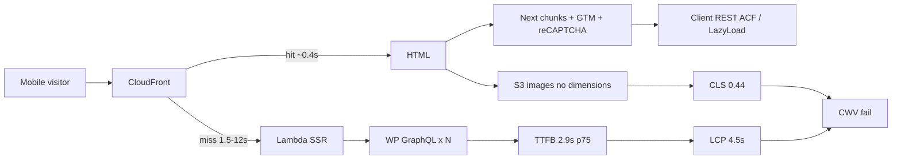

# hecmedia.org mobile PageSpeed fix plan

**Report:** [PageSpeed mobile 29mejls8xx](https://pagespeed.web.dev/analysis/https-hecmedia-org/29mejls8xx?form_factor=mobile) (14 Aug 2026, 7:29 PM)  
**Sibling:** [desktop plan](./PAGESPEED-DESKTOP-FIX-PLAN-2026-08-14.md)  
**Code:** `~/Repos/hecmedia` (Next.js home) + WordPress GraphQL origin (`hectv-wp`)  
**Goal:** Pass mobile Core Web Vitals in CrUX (28-day field), not just a one-off Lighthouse green.

Field data on this report is **origin-level** (not enough samples for the exact URL). Treat the homepage as the LCP/CLS driver.

## What the report says (mobile, 16 Jul–12 Aug 2026)

| Metric | p75 | Pass bar | Status |
|---|---:|---|---|
| **LCP** | **4.5 s** | ≤ 2.5 s | Fail (31% poor) |
| **INP** | 128 ms | ≤ 200 ms | Pass |
| **CLS** | **0.44** | ≤ 0.1 | Fail (33% poor) |
| FCP | 3.4 s | ≤ 1.8 s | Fail |
| TTFB | **2.9 s** | ≤ 0.8 s | Fail (50% poor) |

Desktop is better and still fails (LCP 3.3 s, CLS 0.24, TTFB 1.7 s). **INP is not the problem.** Do not spend the first sprint on interaction polish.

Live check 2026-08-14 (St. Louis / ORD CloudFront):

- HTML **222 KB**, no `Cache-Control`
- First request: **CloudFront Miss**, TTFB **1.52 s**
- Immediate repeat: **Hit**, TTFB **0.43 s**, `age: 4`
- 16 `` tags; **none have `width`/`height`**
- Homepage loads **reCAPTCHA**, **GTM**, **Bootstrap 3.3.7**, **Slick CSS** from CDNs
- Featured/hero media from S3 without `srcset`

This matches the 2026-07-29 staging audit (`workspace/deliverables/hec-perf-audit-2026-07-29/AUDIT.md`): cold origin is GraphQL+SSR; warm edge is fine; payload is still too big.

## Root causes (mapped to code)

1. **TTFB / LCP** — `lib/withApollo.js` runs `getDataFromTree` and walks the whole tree (home + `Layout` queries). Cold HTML waits on several WordPress GraphQL operations. CloudFront HTML cache is short-lived and the cache key is too wide (cookies + query string), so real phones miss more often than a second curl.
2. **CLS** — `components/MediaImage/index.js` renders a raw `` with no width/height/aspect-ratio. `ListOfPosts` wraps thumbs in `react-lazyload` (`height={200}`) so reserved space does not match the real tile. `pages/index.js` hydrates feed layout from REST ACF **after paint** when GraphQL `feedDesign` is empty — that reflows the homepage.
3. **LCP element** — first tile/hero is a full S3 JPEG, not preloaded, often lazy-loaded, no `srcset`/`sizes`, Next image optimizer can be disabled (`HECMEDIA_DISABLE_IMAGE_OPTIMIZER`).
4. **Main-thread / FCP** — `components/SEO/index.js` injects `recaptcha/api.js` on every page. `_app.js` pulls **all** component SCSS via `lib/cssDependencies.scss`. Bootstrap + Slick CSS are render-blocking CDNs. Homepage still ships the newsletter form (`addNewsLetter` on `ListOfPosts`).
5. **Origin work** (when cache misses) — WordPress/ElasticPress transient write failures and fat homepage GraphQL (full `content` on list posts) still apply from the July audit until proven gone on production WP.

## Target

After 28 days of real traffic:

| Metric | Target p75 mobile |
|---|---|
| TTFB | ≤ 0.8 s |
| LCP | ≤ 2.5 s |
| CLS | ≤ 0.1 |
| FCP | ≤ 1.8 s |
| INP | keep ≤ 200 ms |

Lab (Lighthouse mobile) is a gate, not the prize: homepage performance ≥ 80, LCP < 3 s, CLS < 0.1, no “image without dimensions.”

## Workstream 1 — Cache so phones stop hitting SSR (P0)

Owner: infra + `hecmedia` deploy  
Repos: CloudFront / Lambda@Edge config in `hecmedia` production workflow

1. Set anonymous HTML `Cache-Control: public, s-maxage=300, stale-while-revalidate=600` (5 min edge, serve stale while one origin refresh runs). Publish still invalidates `/*`.
2. Stop forwarding **all** cookies on public GETs. Allowlist only auth/session cookies; everyone else shares one cache key.
3. Strip marketing query params (`utm_*`, `gclid`, `fbclid`, `perf_audit`) from the HTML cache key.
4. Emit `Age` / hit-rate metrics (CloudFront additional metrics) so we can see miss rate, not guess from TTFB.

**Done when:** two uncached curls from different query strings share one cached object; logged-out homepage TTFB p75 on a second view is < 400 ms; field TTFB starts falling within a week.

## Workstream 2 — Stop layout shift (P0)

Owner: `hecmedia` frontend  
Files: `components/MediaImage/index.js`, `components/ListOfPosts/index.js`, `pages/index.js`, header/logo

1. Put **explicit `width` + `height`** (or CSS `aspect-ratio` + reserved box) on every `MediaImage`, logo (`white_hec.png`), and play-button overlay.
2. Do **not** lazy-load the first visible/LCP image. Keep `loading="lazy"` only below the fold.
3. Replace `react-lazyload height={200}` with aspect-ratio boxes that match Featured / 3-column / wallpaper tiles on mobile.
4. Remove the post-paint REST ACF layout swap on home (`fetchPageAcfLayout` in `useEffect`). Fix the GraphQL `feedDesign` resolver so SSR HTML is the final layout. If a fallback is still required, run it **in `getInitialProps` / `getDataFromTree`**, never after hydration.
5. Give webfonts `font-display: optional` or `swap` **and** matching fallback metrics if custom fonts are added later (none on the current HTML head, but GTM can inject).

**Done when:** Lighthouse “Image elements do not have explicit width and height” is gone; CLS lab < 0.1; homepage does not change row structure after load.

## Workstream 3 — Make LCP a small, reserved image (P1)

1. Preload the homepage LCP image (`<link rel="preload" as="image" …>` from the first featured post).
2. Serve responsive WebP/AVIF with `srcset`/`sizes` (or turn the Next image optimizer **on** for production and stop using the Akamai no-op loader).
3. Stop shipping full-size S3 originals (`prd-hectv-wp-media/...`) into mobile tiles. `getPostImgSrc(..., "small")` must actually be a small derivative, including the first card.
4. Convert `/static/assets/white_hec.png` and play-button PNGs to compressed SVG/WebP.

**Done when:** LCP resource is < 100 KB on a 360px viewport and starts in the first network round after HTML.

## Workstream 4 — Cut homepage JS/CSS (P1)

1. Remove the global reCAPTCHA `<script>` from `components/SEO/index.js`. Load it only when `NewsletterSignupForm` / Captcha mounts (Intersection Observer or first focus).
2. Do not mount `addNewsLetter` above the fold on home, or defer that island.
3. Split `lib/cssDependencies.scss` — home should not import calendar, map, datepicker, every form, every template.
4. Self-host or drop render-blocking Bootstrap 3.3.7 + Slick CSS on the homepage (or inline the ~2 KB of grid actually used).
5. Keep **one** GTM bootstrap (already enforced). Do not add more third-party tags in `<head>`.
6. Trim homepage GraphQL: no full post `content` in list selections. Target HTML < 100 KB (today 222 KB).

**Done when:** homepage HTML < 100 KB; recaptcha is absent from first document; Lighthouse “Reduce unused JavaScript/CSS” on recaptcha/bootstrap is gone or deferred.

## Workstream 5 — Faster origin on a miss (P1)

Owner: WordPress / `hectv-wp` + Apollo queries

1. One purpose-built public homepage GraphQL document (page + feed rows + first N cards). Do not let `getDataFromTree` fan out 5–6 sequential WP queries.
2. Confirm production WP is not retrying ElasticPress `_transient_ep_es_info` writes on the read replica/task (July defect). Disable EP on the public reader if search is not required for SSR.
3. Cache the homepage query in PHP object cache / a short Redis/file cache keyed by publish revision, so Lambda does not wait 5 s on WP even after a CF miss.
4. Stop client `LiveVideos` POSTs when SSR already returned empty (`cache-first`, stable variables).

**Done when:** a forced CloudFront miss returns HTML in < 1.0 s from ORD (p50), < 2.0 s p95.

## Workstream 6 — Do later (P2)

- Next.js modernization (drop jQuery, Moment, Redux Form) — large, not needed to pass CWV if 1–5 land.
- Scale WP tasks only **after** per-request work drops.
- Route-chunk prefetch: disable hover prefetch on mobile home.

## Suggested PR sequence

| PR | Repo | Scope |
|---|---|---|
| 1 | `hecmedia` | MediaImage + logo dimensions; LCP not lazy; aspect-ratio tiles |
| 2 | `hecmedia` | Move home `feedDesign` fallback to SSR; delete post-hydration REST swap |
| 3 | `hecmedia` | Recaptcha only on form mount; drop SEO global script |
| 4 | CloudFront / deploy | HTML cache policy, cookie/query normalization, SWR |
| 5 | `hecmedia` + `hectv-wp` | Slim homepage GraphQL; WP reader cache / EP off |
| 6 | `hecmedia` | Responsive hero images + preload |

Do **not** combine 4 with 5. Cache first so users stop paying for origin while WP is fixed.

## Verification

1. `curl -sI https://hecmedia.org/` — `x-cache: Hit` on second request; `cache-control` present.
2. Lighthouse mobile on the **same** PageSpeed form (`pagespeed.web.dev`) after each PR.
3. CrUX 28-day: LCP and CLS must both enter “good” before calling this done. INP is already good — watch it does not regress when adding Intersection Observer.
4. Playwright/visual: homepage first paint vs 3 s later — feed row geometry must match (no Featured → 3-column swap).

## Out of scope

- Rewriting the whole site to Next 16 (blocked by Lambda@Edge serverless component; see `DEPLOY.md`).
- Claiming GSA/certs or marketing changes.
- Desktop-only CSS polish. Mobile field is the contract.
