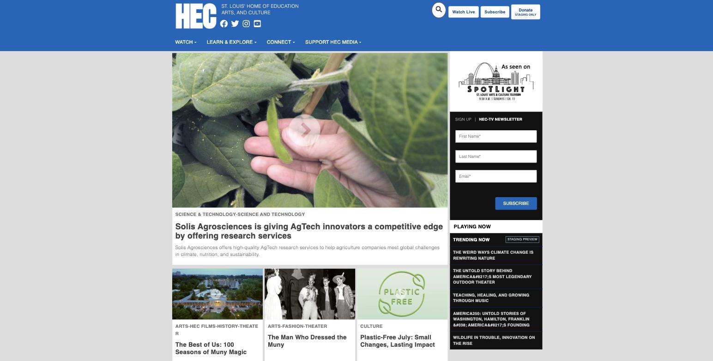

# Visual evidence — deployed staging vs. the client mock

Captured 2026-07-22 from `https://development.hecmedia.org` at master `104363a`, the
commit on which the unit suite is 233/233 green and features A–G (#68041–#68050) are all
closed `done`. See `../../MOCK-GAP-SPEC.md` for the full audit.

Chrome, 1544×784 desktop viewport.

---

## 1. Home page — four requirements visibly unmet in one frame



Read the right rail top to bottom, then the header:

| # | What the frame shows | Requirement |
|---|---|---|
| 1 | The **"As seen on SPOTLIGHT" logo is still there**, at the top of the rail. The mock replaces it with the FOR EDUCATORS notebook card. | **(b)** not delivered — the replacement was built in `ProgramViewer`, which this page never renders |
| 2 | The **HEC-TV NEWSLETTER signup block is still in the rail** (First/Last/Email/SUBSCRIBE). It was supposed to be removed. | **(c)** not delivered — the newsletter was never taken out |
| 3 | **TRENDING NOW sits *below* the newsletter**, carries a client-visible `STAGING PREVIEW` badge, and is a **text list with no thumbnails**. The mock is a thumbnail list in the newsletter's slot. | **(c)** appended instead of replacing; wrong shape and wrong data source |
| 4 | Top-right CTAs read **Watch Live / Subscribe / Donate**, and Donate carries a **`STAGING ONLY`** badge — it is a dead `<button>` that navigates nowhere. The mock says SUBSCRIBE / SUPPORT / GET INVOLVED. | **(g)** partial, hardcoded, one dead control |
| 5 | Nav reads **WATCH · LEARN & EXPLORE · CONNECT · SUPPORT HEC MEDIA**. The mock says ABOUT · PROGRAMS · PRODUCTION SERVICES · WATCH NOW · READ NOW. | **(e)** labels come from a hardcoded keyword matcher, not the CMS menu |

Not visible in a still, but measured in the same DOM:

```js
document.querySelectorAll('.col-lg-3 form').length                          // 1  — newsletter still in the rail
document.querySelectorAll('.educators-card').length                         // 0  — (b) replacement absent
document.querySelectorAll('[class*=trending] img').length                   // 0  — (c) no thumbnails
document.querySelectorAll('.dropdown-menu .dropdown-menu, .dropdown-menu li ul').length  // 0  — (e) no sub-dropdowns
```

Requirement **(a) sticky header is genuinely delivered** — `header--sticky`, computed
`position: sticky`. It is the one that passes.

---

## 2. `/newsletter/thank-you` — the redirect target 404s


```
GET https://development.hecmedia.org/newsletter        -> 200
GET https://development.hecmedia.org/newsletter/thank-you -> 404
```

`pages/newsletter/thank-you.js` exists and `Router.push("/newsletter/thank-you")` is
wired, so this is **green in Jest and broken in production**. `route-list.json`'s catch-all
is `{"page": "[page]/", "pattern": "/:page"}` — a single segment, so nothing matches the
two-segment path once the app is built to `target: "experimental-serverless-trace"` and
served through Lambda@Edge.

This is the highest-severity item in the audit: a client-facing form that dead-ends on
submit. It is also why the plan requires a hard assertion in `scripts/verify-staging.js`
rather than a test alone — **this class of bug cannot reproduce locally**. Measured the
same day against the local stack:

```
local   (yarn dev, :3000)            GET /newsletter/thank-you -> 200
staging (Lambda@Edge, CloudFront)    GET /newsletter/thank-you -> 404
```

---

These images are the "before" state. `tests/acceptance/mock-parity.spec.js` encodes the
same gaps as executable assertions: against staging it reports **12 failed / 2 passed**,
and each failure turns green as its remediation task (T1–T6, #82689–#82694) lands.
